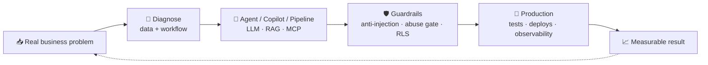

<div align="center">


<h3>Super Individual Contributor — I use AI as an operating system<br/>to deliver the output of an entire team.</h3>

<p><em>From diagnosing the problem → to the end-to-end solution → to the measurable result.</em></p>

[](https://github.com/vitoropereira)
[](https://www.linkedin.com/in/vitor-onofre-pereira)
[](https://www.youtube.com/@vitoropereira?sub_confirmation=1)
[](https://api.whatsapp.com/send?phone=5581996733973&text=Hello!)
[](mailto:vop1234@hotmail.com)


</div>

<hr>

## 🧠 `whoami`

```ts
const vitor = {
  role: "Software Engineer · Applied AI (Agents, LLMs & Automation)",
  experience: "12+ years building and scaling SaaS platforms",
  location: "Curitiba, Brazil 🇧🇷 · open to relocation to São Paulo",
  currently: ["Pixel Educação", "SARCORPS (co-founder)", "ClearSeg (co-founder & CTO)"],
  previousLife: "Air Traffic Controller @ DECEA / CINDACTA (2007–2022)",
  motto: "Zero margin for error. Ship it anyway.",

  buildsWithAI: [
    "autonomous agents (Telegram / WhatsApp) with custom guardrails",
    "in-product AI copilots grounded on each client's business data",
    "LLM + Whisper summarization pipelines running every 3 minutes",
    "AI fleets governed as code, multi-tenant and isolated",
  ],
};
```

<hr>

## 🚀 AI Impact — real numbers, in production

| 🎯 What I shipped | 📊 The number |
| :--- | :--- |
| **Conversational AI agent operated live** at a founders workshop (Sebrae) | **70+ concurrent users** (~103 total) · **2,411 messages** in **123 sessions** — in minutes |
| **In-product AI Copilot** — natural-language Q&A over each client's business data | **Sole author** of the AI layer (OpenAI + Vercel AI SDK, context grounding) |
| **AI summarization pipeline** (automation + LLM + audio transcription) | **~700 automated analyses / day**, running every **3 minutes** |
| **WhatsApp-group analytics SaaS** (Next.js + Node/Express) | **3.6M+ interactions** across **~2,900 groups** |
| **AI fleet as code** (Tailscale + supervisor agent) | **19 governed agents** · **9 servers** monitored · isolated multi-tenant infra |
| **Event-driven core platform** (Node/TS + PostgreSQL) | **~400 production deploys** with a **165-test suite** green ✅ |
| **Campaign & email pipeline** | broadcast delivered to **~26.6k contacts** |
| **"Funcionário de IA" mentorship** — created & taught from scratch | beta cohort rated **9.0 / 10** |

<hr>

## ⚙️ How I ship AI



> **Guardrails are not decoration.** The trust boundary is the server, not the UI — RLS, `SECURITY DEFINER`, rate-limiting and PII sanitization ship with the feature, not after it.

<hr>

## 🛠️ Currently building

- 🧩 **[Pixel Educação](https://pixeleducacao.com.br)** — Lead engineer of the event-driven core platform: multi-provider payment webhooks, lead attribution, automations + a fleet of autonomous AI agents for go-to-market, onboarding and student diagnosis.
- 🛟 **SARCORPS** — Co-founder & full-stack co-lead of a **mission-critical Search & Rescue (SAR) operations platform** for the aviation/defense sector (international **IAMSAR** standard). Nuxt 3/4 + Vue 3 + TypeScript + Supabase, with an in-app LLM assistant and a Python geospatial/simulation engine. Owner of data security, i18n (pt/en/es) and WCAG accessibility.
- 🧾 **ClearSeg** — Co-founder & CTO of an **AI-powered recurring billing platform for insurance brokers**: AI invoice reading (classification + extraction), white-label automated billing and portfolio management.
- 🎓 **"Funcionário de IA"** — Creator & instructor of an applied-AI mentorship: I translate agents, automation and LLMs into practical use for **non-technical audiences**.

<hr>

## 🎬 I also build this stuff on camera

<div align="center">

I run a **YouTube channel (in 🇧🇷 Portuguese)** where I build AI agents, automations and dev-tooling **live and unfiltered** — including the parts that break. Real agents, real bugs, real fixes.

[](https://www.youtube.com/@vitoropereira?sub_confirmation=1)
[](https://www.youtube.com/@vitoropereira)

### ▶️ Latest videos

<!-- BEGIN YOUTUBE-CARDS -->
<a href="https://www.youtube.com/shorts/c9d4kzNLyeA">
  <picture>
    <source media="(prefers-color-scheme: dark)" srcset="https://ytcards.demolab.com/?id=c9d4kzNLyeA&title=Mais+de+70+agentes+em+paralelo.+Ainda+faltam+4+dias+para+renovar+minha+sess%C3%A3o+semanal.+%F0%9F%A4%AF%F0%9F%9A%80&lang=pt&timestamp=1785885114&background_color=%230d1117&title_color=%23e6edf3&stats_color=%238b949e&max_title_lines=2&width=250&border_radius=10">
    
  </picture>
</a>
<a href="https://www.youtube.com/shorts/hGYCilaIyNc">
  <picture>
    <source media="(prefers-color-scheme: dark)" srcset="https://ytcards.demolab.com/?id=hGYCilaIyNc&title=Meu+agente+l%C3%AA+meu+whatsap+%23produtividade+%23chatgpt+%23agentedeia&lang=pt&timestamp=1785157409&background_color=%230d1117&title_color=%23e6edf3&stats_color=%238b949e&max_title_lines=2&width=250&border_radius=10">
    
  </picture>
</a>
<a href="https://www.youtube.com/shorts/Yt-gT3-WqOA">
  <picture>
    <source media="(prefers-color-scheme: dark)" srcset="https://ytcards.demolab.com/?id=Yt-gT3-WqOA&title=conectei+meu+whatsapp+a+um+agente+de+ia+sem+programar+nada+1+%23agentedeia+%23chatgpt+%23aicoding&lang=pt&timestamp=1784824391&background_color=%230d1117&title_color=%23e6edf3&stats_color=%238b949e&max_title_lines=2&width=250&border_radius=10">
    
  </picture>
</a>
<a href="https://www.youtube.com/watch?v=nD_oQdK7PxA">
  <picture>
    <source media="(prefers-color-scheme: dark)" srcset="https://ytcards.demolab.com/?id=nD_oQdK7PxA&title=Conectei+meu+WhatsApp+a+um+agente+de+IA+%28Hermes%29+SEM+PROGRAMAR&lang=pt&timestamp=1784638679&background_color=%230d1117&title_color=%23e6edf3&stats_color=%238b949e&max_title_lines=2&width=250&border_radius=10">
    
  </picture>
</a>
<!-- END YOUTUBE-CARDS -->

<sub>🤖 This list updates itself daily via GitHub Actions — the README is an automation too.</sub>

</div>

<hr>

## 🧰 Languages & Tools

<div align="center">

**AI & LLMs**


**Automation & Orchestration**


**Code, Data & Infra**

[](https://skillicons.dev)
[](https://skillicons.dev)

<small><i><strong>…and much more!</strong></i></small>

</div>

<hr>

## 🛩️ Plot twist: before code, I ran airspace

For **15 years (2007–2022)** I was an **Air Traffic Controller / Operator at DECEA / CINDACTA**, the Brazilian airspace control authority — an environment of extreme pressure, **zero margin for error** and decision-making under uncertainty.

That's where the ownership discipline came from. Today I point it at production systems and AI:

```
  ✈️  separation minima   →   guardrails & rate limits
  📡  radar vectoring     →   observability & tracing
  🆘  emergency handling  →   incident response
  🗣️  standard phraseology→   executive communication
```

<hr>

<div align="center">

## 📊 GitHub in numbers

<a href="#" alt="streaks">
	<picture>
		<source
			srcset="https://github-readme-streak-stats.herokuapp.com/?user=vitoropereira&hide_border=true&count_private=true&show_icons=true&include_all_commits=true&theme=github-dark-blue&hifr"
			media="(prefers-color-scheme: dark)"
		/>
		<source
			srcset="https://github-readme-streak-stats.herokuapp.com/?user=vitoropereira&hide_border=true&count_private=true&show_icons=true&include_all_commits=true&theme=ocean-gradient"
			media="(prefers-color-scheme: dark), (prefers-color-scheme: no-preference)"
		/>
		
	</picture>
</a>

<a href="#" alt="Most Used Languages">
	<picture>
		<source
			srcset="https://github-readme-stats.vercel.app/api/top-langs/?username=vitoropereira&langs_count=8&layout=compact&hide_border=true&theme=github_dark"
			media="(prefers-color-scheme: dark)"
		/>
		<source
			srcset="https://github-readme-stats.vercel.app/api/top-langs/?username=vitoropereira&langs_count=8&layout=compact&hide_border=true"
			media="(prefers-color-scheme: dark), (prefers-color-scheme: no-preference)"
		/>
		
	</picture>
</a>
<a href="#" alt="Stats">
	<picture>
		<source
			srcset="https://github-readme-stats-git-masterrstaa-rickstaa.vercel.app/api?username=vitoropereira&count_private=true&show_icons=true&include_all_commits=true&hide_border=true&theme=github_dark&hifr"
			media="(prefers-color-scheme: dark)"
		/>
		<source
			srcset="https://github-readme-stats-git-masterrstaa-rickstaa.vercel.app/api?username=vitoropereira&count_private=true&show_icons=true&include_all_commits=true&hide_border=true"
			media="(prefers-color-scheme: light), (prefers-color-scheme: no-preference)"
		/>
		
	</picture>
</a>

<a href="#" alt="Graph">
	<picture>
		<source
			srcset="https://github-readme-activity-graph.vercel.app/graph?username=vitoropereira&hide_border=true&theme=github-dark"
			media="(prefers-color-scheme: dark)"
		/>
		<source
			srcset="https://github-readme-activity-graph.vercel.app/graph?username=vitoropereira&hide_border=true&theme=minimal"
			media="(prefers-color-scheme: light), (prefers-color-scheme: no-preference)"
		/>
		
	</picture>
</a>

<hr>

### 🤝 Let's build something that ships

**Open to full-time on-site roles · Applied AI, Agents & Automation**

[](https://www.linkedin.com/in/vitor-onofre-pereira)
[](https://api.whatsapp.com/send?phone=5581996733973&text=Hello!)

<sub>🇧🇷 Portuguese (native) · 🇺🇸 English (intermediate)</sub>

</div>
